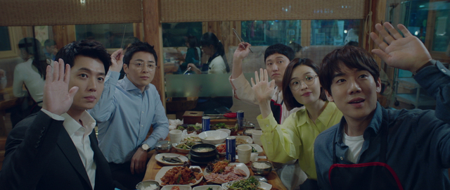
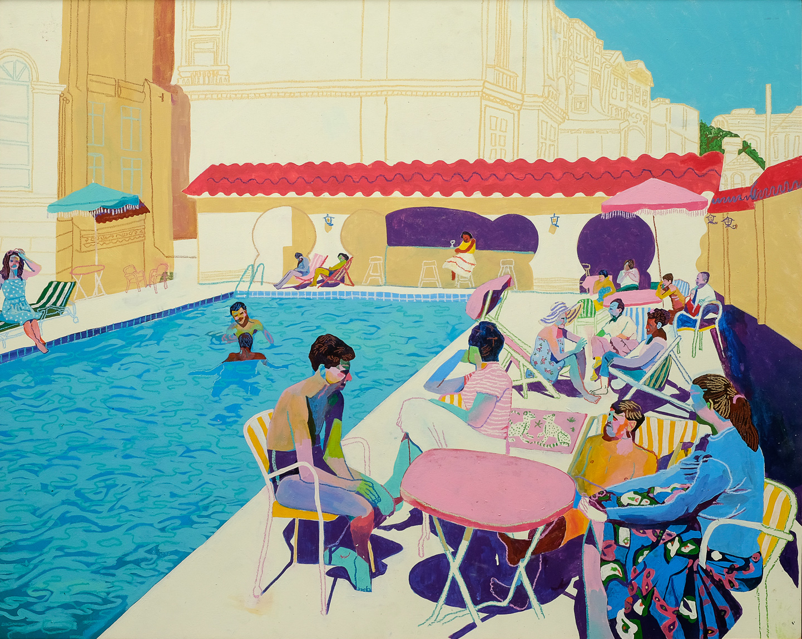
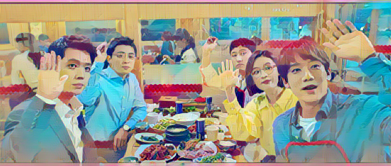
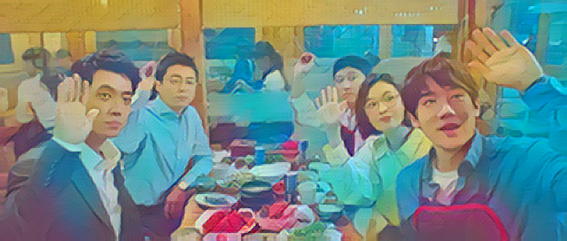
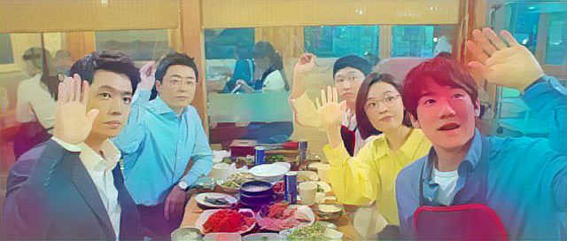

# hospital-playlist-ai
This project aims to implement a style transfer of a photo-realistic picture given a specific art piece style. The algorithm follows `fast-style-transfer` (Perceptual Losses for Real-Time Style Transfer and Super-Resolution, 2016 ECCV) using PyTorch, and the code is based on [pytorch example codes](https://github.com/pytorch/examples/tree/master/fast_neural_style)

### Original Images (Left: Inference image, Right: Style image)
<p align="center">
  
</p>

<p align="center">
  
</p>

### Style Transfer Results
#### A: With 256x256 resized style image
<p align="center">
  
</p>

- Style features are well transferred
- However some parts of the output seem distorted (Like the overwrapped head with the red background in the right center)

#### B: With multiple segments of intermediate resized style image
<p align="center">
  
</p>

- It seems more smoothened and natural than the first one
- But the style features do not stand out well. There exists also some noisy color transferring - overall the color seems too blueish
- Though, the segment-wise nuance and color theme features are well transferred

#### C: With original size style image
<p align="center">
  
</p>

- An extreme case for comparison
- The result seems too noisy and pixel-wise nuanced
- Geometric and color features are not well transformed either


### What to Next
- How to automatically sync the object scale between inference and style images?
- How to determine the ratio between style and content loss weights automatically?
- Trying EfficientNet(Google, 2019) as a pre-trained net instead of VGG16/ResNets

*Latest update : 06/23/2020*

## Contributor
* detshawn

## Requirements
```python
torch
torchvision
numpy
opencv-python
image
ipython
matplotlib
```

## Reference
- <a href="https://github.com/pytorch/examples/tree/master/fast_neural_style" target="_blank"> pytorch example code </a>
- <a href="https://colab.research.google.com/" target="_blank"> google colaboratory </a>
